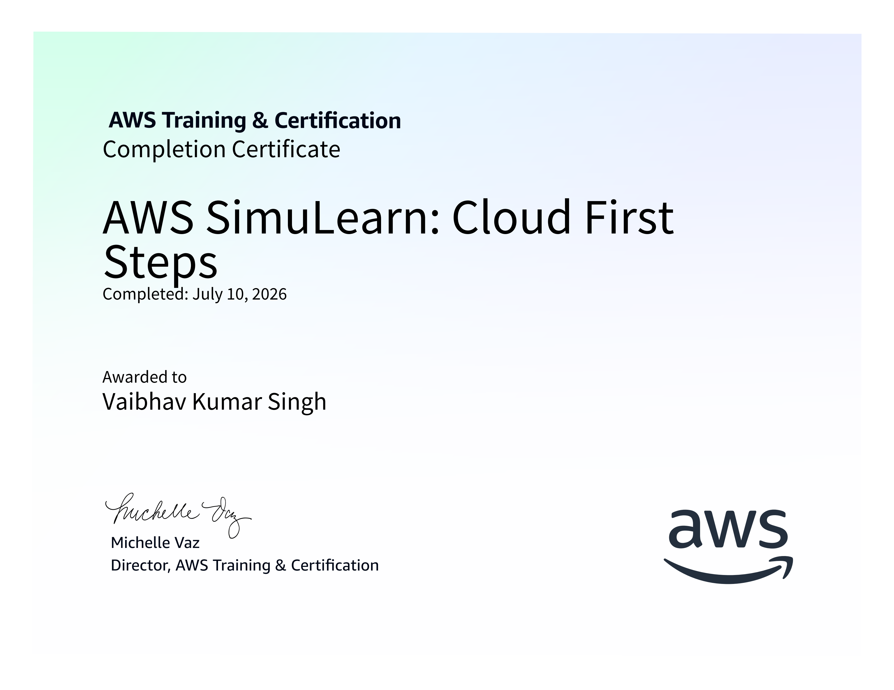
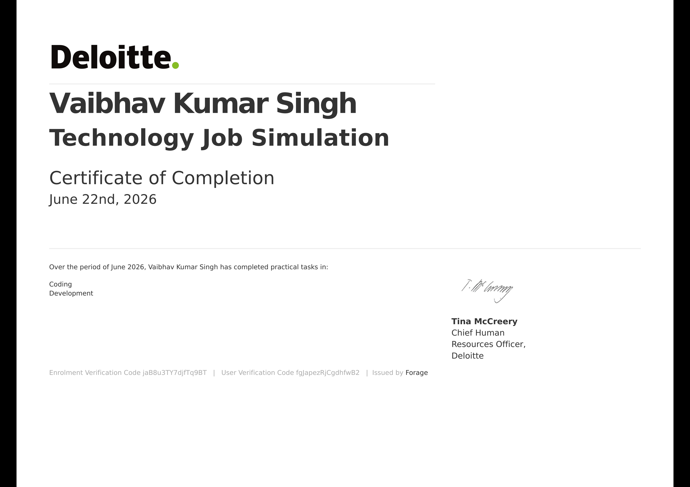
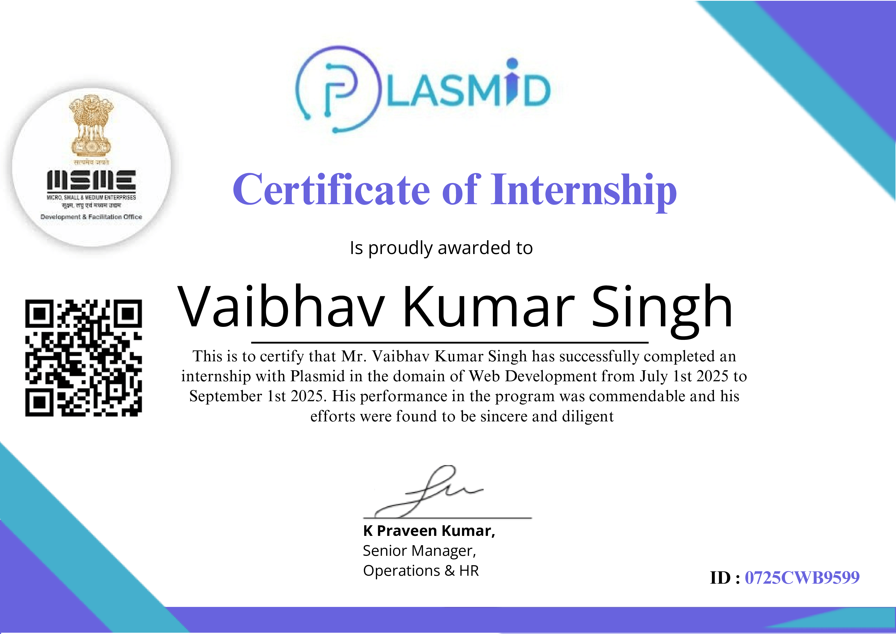
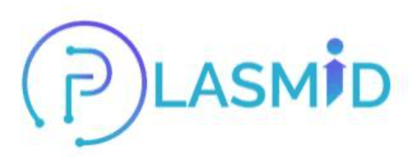
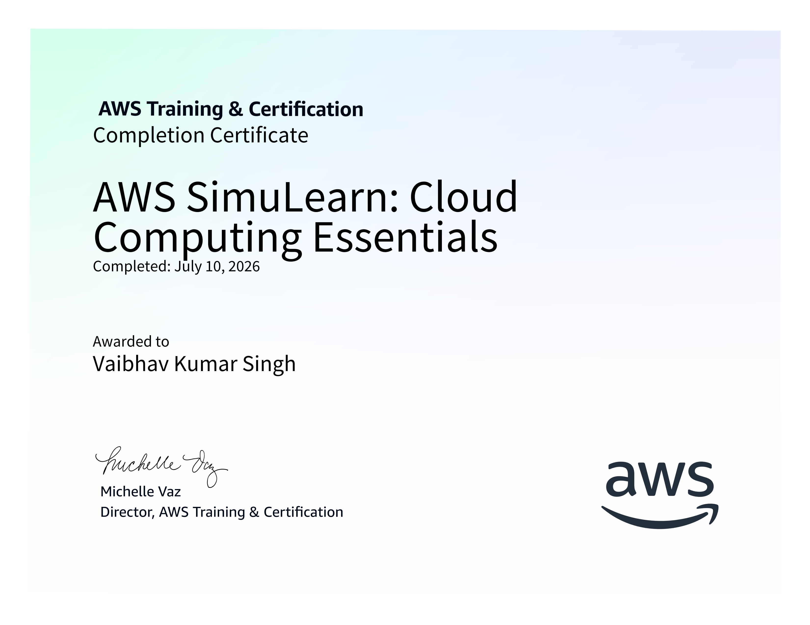
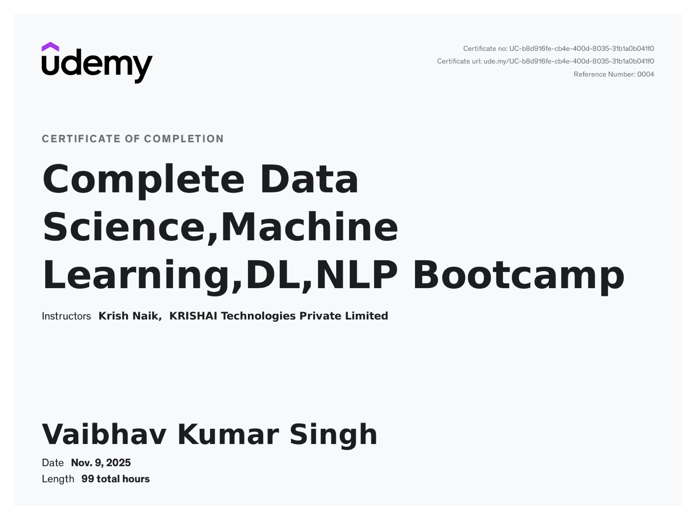
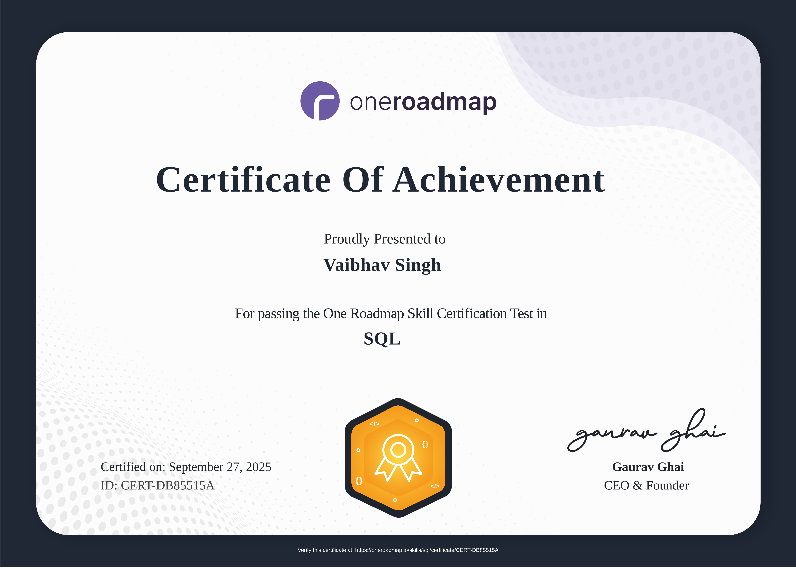
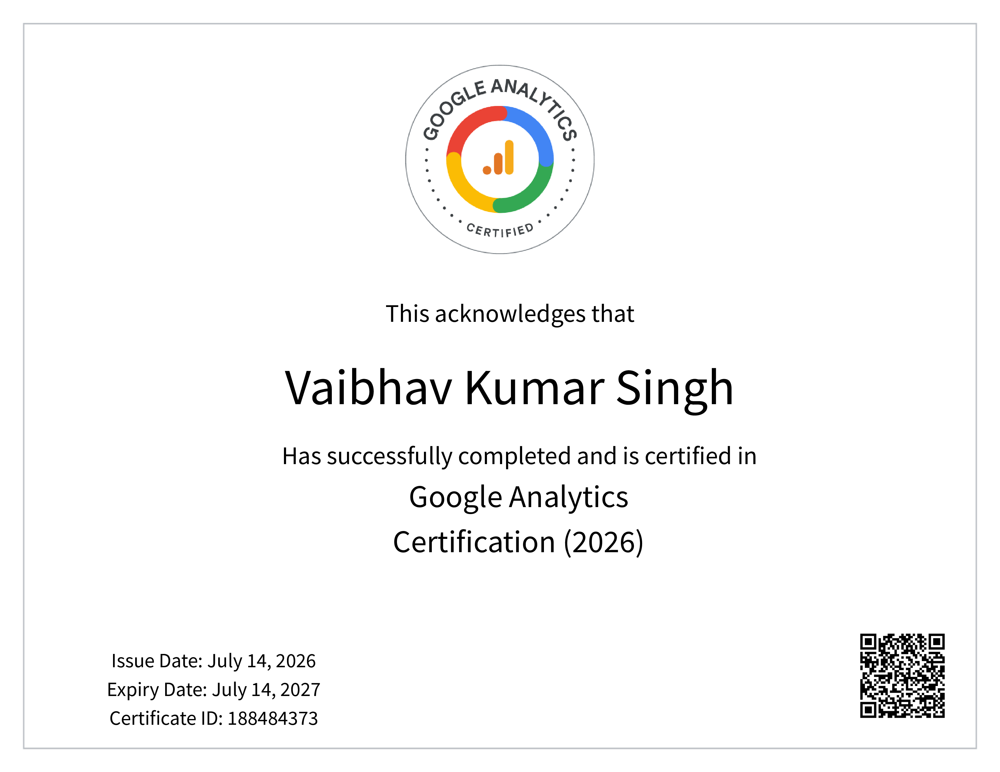
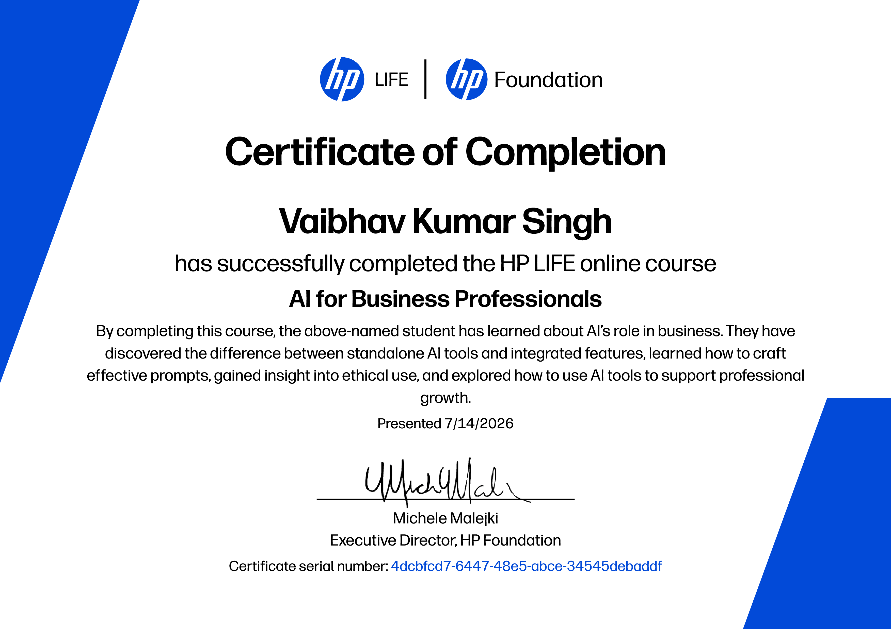

<!-- ====================== NAVIGATION ====================== -->

<a href="#about-me">About</a>
&nbsp;&nbsp;•&nbsp;&nbsp;
<a href="#tech-stack">Tech Stack</a>
&nbsp;&nbsp;•&nbsp;&nbsp;
<a href="#certifications">Certifications</a>
&nbsp;&nbsp;•&nbsp;&nbsp;
<a href="#github-dashboard">Dashboard</a>
&nbsp;&nbsp;•&nbsp;&nbsp;
<a href="#featured-repository">Projects</a>
&nbsp;&nbsp;•&nbsp;&nbsp;
<a href="#lets-connect">Contact</a>

 

<!-- ====================== HERO ====================== -->

<!--

 -->

# ⚡ About Me

<table width="100%">
<tr>
<td>

I'm **Vaibhav Singh**, an **Artificial Intelligence & Machine Learning** student passionate about building impactful software and continuously learning modern technologies.

I'm currently exploring **Full Stack Development**, **DevOps**, **Machine Learning**, and **Data Structures & Algorithms**, while building projects that strengthen my engineering fundamentals.

I believe the best way to learn is by **building, experimenting, and improving every day.**

</td>
</tr>
</table>

# 🎛️ Tech Stack

### 💻 Languages

### 🎨 Frontend

### ⚙️ Backend

### 🗄️ Databases

### ☁️ DevOps & Cloud

# 🏆 Certifications

<table>
<tr>

<td align="center">
 

</td>

<td align="center">
 

</td>

<td align="center">
 

</td>

<td align="center">
 

</td>

<td align="center">
 

</td>

<td align="center">
 

</td> 

<td align="center">
 

</td>

<td align="center">
 

</td>

</tr>
</table>

# 📊 GitHub Dashboard

# 📈 GitHub Activity Graph

# 📅 Contribution Calendar

# 💻 LeetCode

# 🚀 Featured Repository

## 📘 Placement Preparation Notes

A complete repository for **DSA, Core CS Subjects, Interview Questions, Roadmaps & Resources**.

<table>
<tr>
<td align="center">📚 DSA</td>
<td align="center">💻 JavaScript</td>
</tr>

<tr>
<td align="center">🗄️ DBMS</td>
<td align="center">⚙️ Operating Systems</td>
</tr>

<tr>
<td align="center">🌐 Computer Networks</td>
<td align="center">🏗️ System Design</td>
</tr>

<tr>
<td align="center">🎯 HR Interviews</td>
<td align="center">📝 Aptitude</td>
</tr>
</table>

 

# 🌐 Let's Connect

<table width="100%">
<tr>

<td align="center" width="25%">

<a href="mailto:vaibhavsingh46614@gmail.com">

**Email**
</a>

</td>

<td align="center" width="25%">

<a href="https://github.com/hyeeVaibhav">

**GitHub**
</a>

</td>

<td align="center" width="25%">

<a href="https://instagram.com/2005_vaibhavsingh">

**Instagram**
</a>

</td>

<td align="center" width="25%">

<a href="https://x.com/Vaibhav37636021">

**X (Twitter)**
</a>

</td>

</tr>
</table>

---

### ✨ Thanks for Stopping By ✨

> **Keep Learning • Keep Building • Keep Growing 🚀**

<!-- -->

### Made with ❤️ by **Vaibhav Singh**

